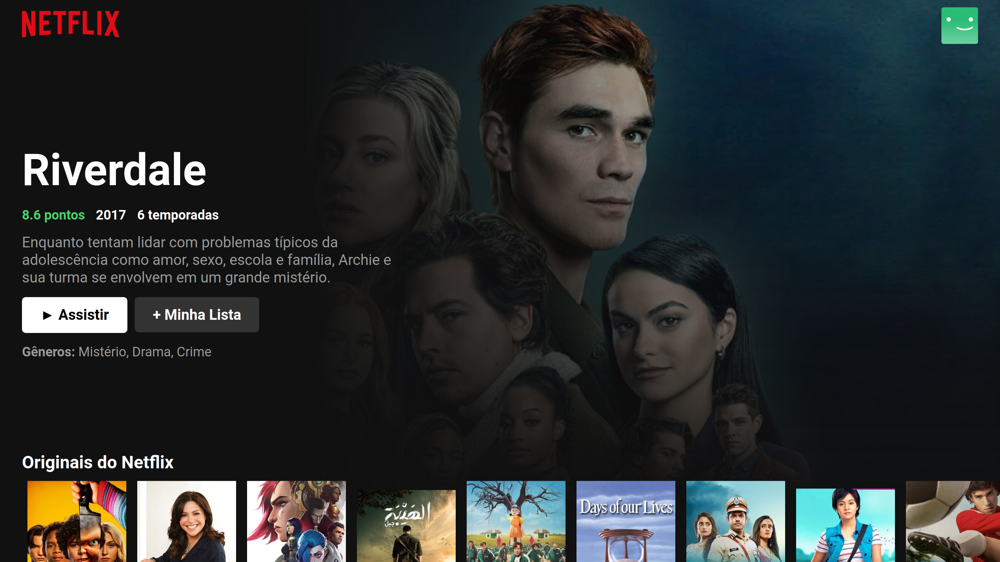

# Untitled

## Netflix Clone com ReactJS

Esse projeto foi desenvolvido visando revisar e aplicar conceitos aprendidos de ReactJS, com o auxílio dos conhecimentos do Bonieky Lacerda.

- Conhecimentos aprimorados
    - HTML
    - CSS
    - JavaScript
    - ReactJS
    - Git

- Imagem

